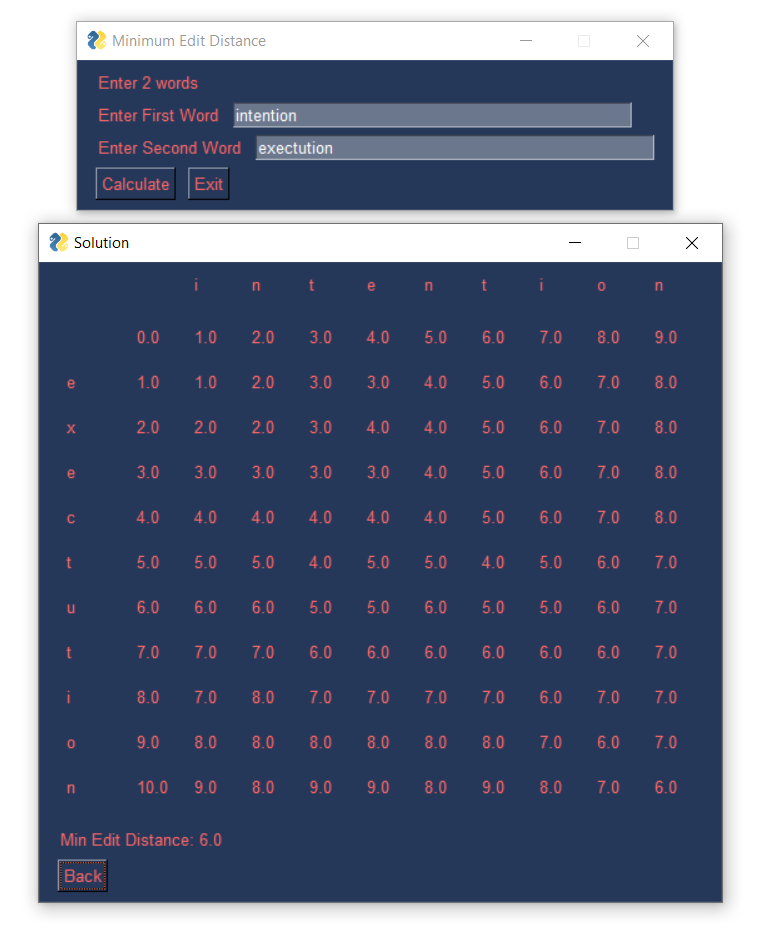

# Minimum Edit Distance GUI
Uses a Graphical User Interface to find the Minimum Edit Distance between two Strings. Edits include Insertion, Deletions &amp; Substitutions. 
Implemented using <b>Dynamic programming</b> and offers a Default solution as well as <b>Levenshtein</b> implementation.   
Implemented based on theory from http://www.stanford.edu/class/cs124/lec/med.pdf
## Example Output

Ran to find distance between "intention" and "exectution"

